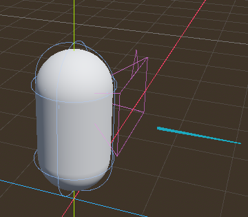
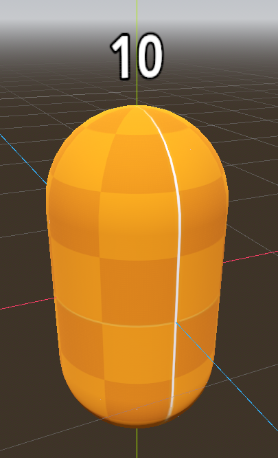
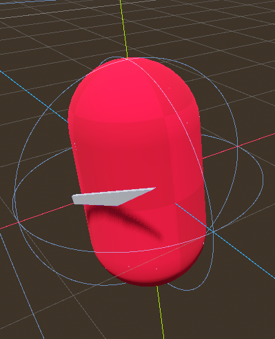
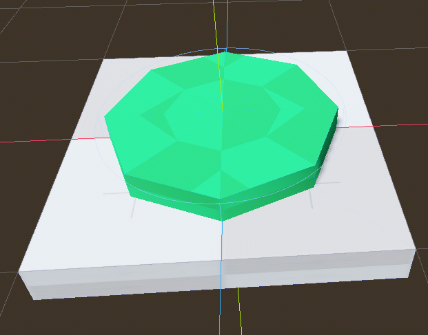
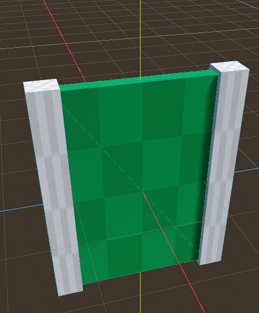
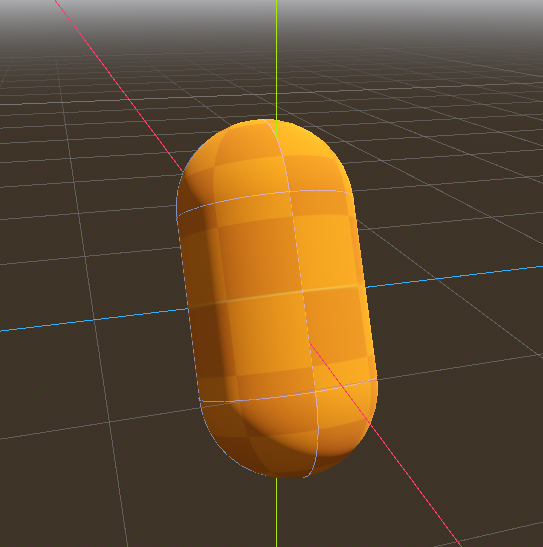
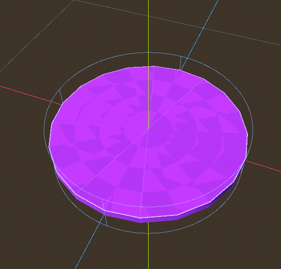

# My Friend Larry
## Documentacion y breve historia

## Historia
Larry es tu mejor amigo, el te ayudara a superar
una seria de niveles, cuando el no este, es porque confia 
de tus capacidades, nunca dudes de Larry, Larry es tu amigo
en cambio, Barry... no hablemos de Barry

## Documentacion
La consigna pide documentar los scrips, sin embargo, son muchos y para ahorrar trabajo dividire esta sección en Personajes, Elementos y comentare los scrips que manejan cada uno, asi es mas facil entender el funcionamiento de todo en un solo sitio.

## Observaciones
Quisiera aclarar que si bien godot ofrece muchos elementos para realizar un juego, a primera instancia no ofrece un template como en Unity o Unreal, todos los elementos aqui descritos fueron hechos desde cero.

## Vamos a jugar
Para facilitar la hora de jugar se puede abrir el .exe que esta en la carpeta 'builds'.

## Como levanto el proyecto?
Bastaria con tener instalado(descargado) Godot en su version 4.1.1 y al ejecutar seleccionar la opcion "Scan" y buscar este proyecto.

### Personajes

#### Player

Es el personaje que controlamos, entre los metodos que podemos observar en su script tenemos:

- _input(event): Este metodo es de godot y permite captar de forma global todos los eventos que ocurren en la escena, para el jugador solo filtramos los eventos de movimiento del mouse, los cuales nos permite mover la camara y tener vision total del escenario donde estamos.

- _process(delta): Este metodo tambien es de godot y se llama cada frame, siendo delta el tiempo diferencial entre el frame anterior y el actual, _process es especializado para captar los Inputs mapeados del jugador, en este caso nos interesa captar el evento click izquierdo

- _charging_launch(delta): Es un metodo propio del player, con el se inicia la carga para lanzar a larry, mientras se mantiene presionado el click izquierdo un progress-bar va aumentando su valor en base al delta time transcurrido, larry sera lanzado solo cuando se suelte el click izquierdo, a su vez se emitira una señal (signal) llamada 'larry_fired' esto le avisa a quien lo escuche que el jugador acaba de disparar a larry, esta señal es usada mas que todo por los level_manager.

- _physics_process(delta): Este metodo es de godot y como dice su nombre, se ejecuta cada frame pero con la ventaja que aqui se puede manipular mejor las fisicas del juego, lo uso para mover al jugador en base a la direccion en la que este apuntando y las teclas AWSD que indican el movimiento.

- _fire_larry(): Lanza a larry y es quien en si emite la señal de 'larry_fired', lo bueno de godot es que antes de que Larry entre en la escena se puede configurar y lo que se procura es darle una posicion inicial en base a donde esta el jugador y se rota 90 grados, esto con la finalidad de que el conteo regresivo de larry se lea correctamente, luego se determina la direccion en la que va a caminar y cuando este todo listo se agrega a larry en la escena.

#### Larry

Es nuestro mejor amigo y quien nos ayudara en todo.

- initialize(direction, player, time_to_run): permite inicializar a larry, guardando los valores basico para que pueda actuar, la direccion le indicara hacia donde debe correr, el player es una referencia al jugador, la idea es usar como origen para que la cabeza de larry siempre apunte al jugador con la finalidad de que el contador sea siempre visible, y time_to_run no es mas que el tiempo que se mantuvo presionado el click izquierdo y que le indicara a larry por cuanto tiempo debe correr.

- _time_to_live: esta constante define el tiempo de vida de larry, apenas aparece en el escenario su tiempo se ira reduciendo cada segundo hasta llegar a cero y luego desaparecera.

- _ready(): es un metodo de godot que permite ejecutar codigo apenas el nodo este listo, en el caso de larry lo uso para crear dos timers, uno para hacer el conteo de su tiempo de vida y otro que define hasta cuanto puede correr.

- _process(delta): uso _process para descontar contiamente el tiempo de vida de larry y mostrarselo al jugador.

- _on_run_timeout(): se llama cuando el tiempo para correr se acaba y hace que larry no tenga una direccion particular donde correr.

- _on_life_timeout(): borra a larry de la escena cuando su tiempo de vida llegue a cero.

- _physics_process(delta): Aqui solo movemos a larry en caso de que tenga alguna direccion, si no tiene ninguna, solo se quedara parado en el lugar.

#### Barry

Es nuestro enemigo, buscara la forma de matarnos y cualquiera que se le acerque lo suficiente recibira grandes daños, EVITARLO A TODA COSTA.

- _physics_process(delta): se mantiene mirando al objetivo, este puede ser tanto el jugador o larry, si lo detecta este ira caminando hacia el, de resto se mantendra en el lugar.

- _on_player_entered(body): este evento se ejecuta en base a un area de deteccion que posee barry, si el jugador o larry entra en dicha area se dispara el evento y se guardara el objetivo que haya entrado.

- _on_killing_zone_body_entered(body): una vez barry tenga un objetivo claro, este lo perseguira y si el objetivo entra en el area de asesinato, barry emitira una señal de que mato al jugador (esto solo aplica para el jugador, Larry no puede morir en manos de barry).

- _on_killing_zone_body_exited(): en caso de que el objetivo (target) se haya salido de la zona de asesinato, barry se movera automaticamente para buscarlo de nuevo.

### Elementos
#### World Button

Este componente dispone solo de dos señales

- pressed: la cual se emite si el jugador o larry presionan el boton
- released: se ejecuta cuando el jugador o larry dejan de estar por encima del boton

#### Door

Solo tiene 2 metodos:

- open_door(): ejecuta la animacion "open"
- close_door(): ejecuta en sentido contrario la animacion "open"

#### Capsule Larry

Solo posee una animacion para subir y bajar y rotar cuando el jugador lo toca se ejecuta el evento _on_player_touch el cual detiene la animacion y elimina la capsula.

#### Victory Zone

emite una señal cuando el jugador toca el area, la señal emitida es de victoria 'victory' y da por concluido el nivel

### Niveles
Todos los niveles poseen un scrip manager el cual orquestra los distintos componentes de su escenario, ejemplo si hay un boton y este es presionado el evento 'pressed' del boton es leido por la escena y este segun la logica que tenga podria o abrir una puerta, o hacer andar una plataforma, ningun elemento en el juego esta fuertemente ligado a otro, como se menciono, esto lo administra el mismo script del nivel.
